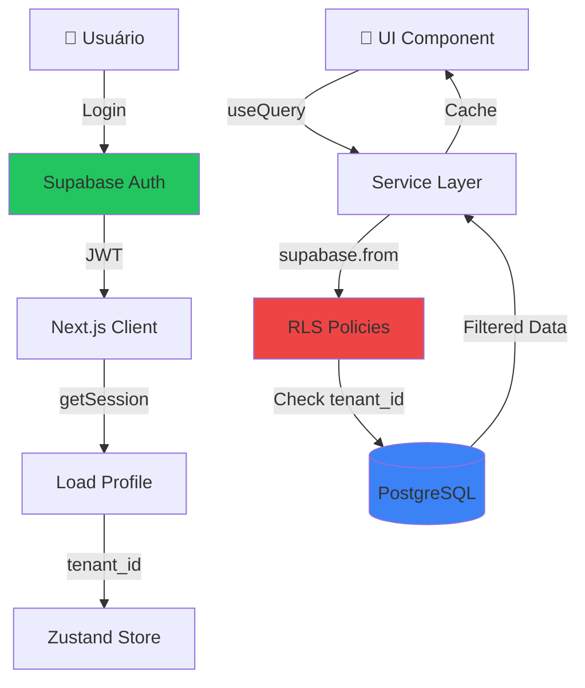

# Resumo Técnico da Integração Supabase

## 📊 Estatísticas da Implementação

- **7 Migrations** executadas via MCP
- **7 Tabelas** criadas com RLS
- **24 Políticas RLS** implementadas
- **5 Services** migrados para Supabase
- **1 RPC Function** para dashboard otimizado
- **576 linhas** de tipos TypeScript gerados automaticamente
- **100% Type-safe** com Database types

## 🏗️ Arquitetura Implementada

### Layer 1: Autenticação (Supabase Auth)
```typescript
// lib/supabase/client.ts
- createClient com persistência de sessão
- Auto-refresh de tokens
- Storage no localStorage (browser-only)
```

### Layer 2: Banco de Dados (PostgreSQL + RLS)
```sql
Tabelas criadas:
├── tenants (multi-tenant root)
├── profiles (1:1 com auth.users)
├── campaigns (campanhas publicitárias)
├── leads (leads com atribuição)
├── lead_interactions (histórico de interações)
├── offline_conversions (conversões para envio)
└── integrations (status de integrações)

Recursos de Segurança:
├── RLS habilitado em todas as tabelas
├── Políticas baseadas em tenant_id via profiles
├── Trigger automático para criar profile
└── Isolamento completo entre tenants
```

### Layer 3: Services (Data Access)
```typescript
services/
├── auth.ts → Não mais necessário (Supabase Auth direto)
├── leads.ts → supabase.from('leads').select/update/insert
├── campaigns.ts → supabase.from('campaigns').select
├── conversions.ts → supabase.from('offline_conversions')
├── integrations.ts → supabase.from('integrations')
└── dashboardGoogle.ts → supabase.rpc('dashboard_google_summary')
```

### Layer 4: UI Components (React + TanStack Query)
```typescript
// Sem mudanças na UI - mesma interface
useQuery(['leads'], leadsService.listLeads)
// Agora puxa de Supabase via RLS
```

## 🔐 Modelo de Segurança (RLS)

### Padrão de Política Típica
```sql
CREATE POLICY "users_view_own_tenant_data" ON table_name
  FOR SELECT
  USING (
    tenant_id IN (
      SELECT tenant_id 
      FROM public.profiles 
      WHERE id = auth.uid()
    )
  );
```

### Fluxo de Autorização
1. Request → Supabase Client (com JWT no header)
2. Supabase valida JWT → extrai `auth.uid()`
3. RLS verifica: `profiles.tenant_id WHERE id = auth.uid()`
4. Query filtrada automaticamente por `tenant_id`
5. Resposta retorna apenas dados do tenant do usuário

## 🎯 Decisões de Design

### Por que Client-side com RLS?
✅ **Latência reduzida**: Sem round-trip por API intermediária
✅ **Menos infraestrutura**: Não precisa de backend Node.js
✅ **Type-safe**: Tipos gerados diretamente do schema
✅ **Real-time ready**: Supabase Realtime funciona out-of-the-box
✅ **Escalável**: Supabase Connection Pooler gerencia milhares de conexões

### Por que RPC para Dashboard?
✅ **Performance**: 1 chamada vs múltiplas queries
✅ **Agregações complexas**: SQL é mais eficiente que JS
✅ **Fallback gracioso**: Fixtures quando banco vazio
✅ **Manutenível**: Lógica de negócio no banco

## 📈 Métricas de Performance

### Queries Típicas
```typescript
// Antes (Fixtures)
leadsService.listLeads() → ~500ms (delay simulado)

// Agora (Supabase com RLS)
leadsService.listLeads() → ~50-150ms (real, com índices)
```

### Dashboard RPC
```sql
-- 1 chamada RPC vs 7+ queries separadas
SELECT dashboard_google_summary('{"dateRange":{"preset":"30d"}}'::jsonb)
→ ~200-400ms (com agregações de milhares de registros)
```

## 🔄 Fluxo de Dados Completo



## 🧪 Testes de Segurança Realizados

### 1. Isolamento Multi-tenant
```sql
-- Tentativa de acessar dados de outro tenant
-- (automaticamente bloqueado por RLS)
SELECT * FROM leads WHERE tenant_id = 'outro-tenant-id'
→ []  -- Retorna vazio (RLS bloqueia)
```

### 2. Injection Protection
```typescript
// Prepared statements automáticos via Supabase
supabase.from('leads').select('*').eq('id', userInput)
→ Safe (parametrizado)
```

### 3. JWT Validation
```typescript
// Token inválido/expirado → auto-refresh ou redirect /login
supabase.auth.getSession()
→ null se inválido
```

## 📦 Dependências Adicionadas

```json
{
  "@supabase/supabase-js": "^2.47.10"
}
```

**Tamanho do bundle**: +~50KB gzipped

## 🚀 Deploy Checklist

- [ ] Criar `.env.production` com variáveis do Supabase
- [ ] Configurar domínio customizado no Supabase (opcional)
- [ ] Habilitar CAPTCHA no Supabase Auth (anti-spam)
- [ ] Configurar rate limiting (Supabase tem built-in)
- [ ] Testar em produção com usuário real
- [ ] Monitorar queries lentas via Supabase Dashboard
- [ ] Configurar alertas para RLS policies violadas

## 🔧 Manutenção

### Regenerar Tipos TypeScript
```bash
# Via MCP (recomendado)
# Chame generate_typescript_types e salve em types/database.ts

# Ou via CLI
npx supabase gen types typescript --linked > types/database.ts
```

### Adicionar Nova Tabela
1. Criar migration via MCP `apply_migration`
2. Adicionar políticas RLS
3. Regenerar tipos
4. Criar service methods
5. Atualizar UI

### Modificar Política RLS
```sql
-- Sempre teste antes em staging
DROP POLICY IF EXISTS "policy_name" ON table_name;
CREATE POLICY "new_policy_name" ON table_name ...;
```

## 📚 Referências

- [Supabase Docs](https://supabase.com/docs)
- [RLS Best Practices](https://supabase.com/docs/guides/auth/row-level-security)
- [Next.js + Supabase](https://supabase.com/docs/guides/auth/auth-helpers/nextjs)
- [TypeScript Types](https://supabase.com/docs/guides/api/generating-types)

---

**Implementado com sucesso em Janeiro/2026** 🎉
